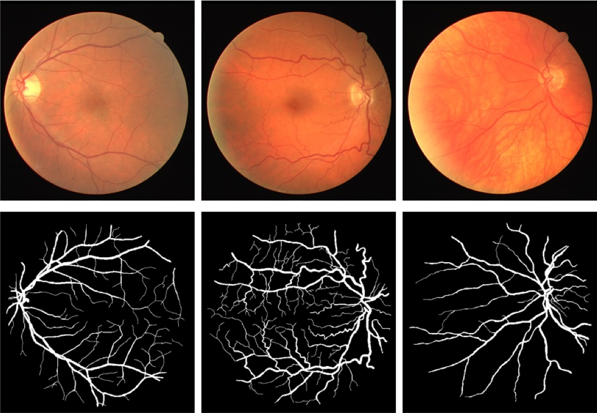

# Fundus Image Segmentation Base On U-Net

Code for the Internship at Key Laboratory in Intelligent Medical Image Computing at Northeastern University

```
project
│   README.md
└───Data
│   └───Seg_train
│   │   └──1st_manual
│   │   └──images
│   │ 
│   └───Seg_train_aug
│   │   └──1st_manual
│   │   └──images
│   │
│   └───augmentation.py
│   └───augmentation_tools.py
│ 
└───Model
│       
│ 
└───res
│       
└───DataSet.py
│       
└───config.py
│       
└───test.py
│       
└───tool.py
│       
└───Net.py
│       
└───Train_net.py
│       
└───train.py
```

## Method

We use U-Net as the backbone for fundus image segmentation


## Result

We use ***dice*** as main evaluation metric, Our method achieves better results on the internal dataset(dice:92.31)



## Commands

### 1. Train

```
python train.py
```

Checkpoints will be saved in `./Model/`

### 2. Inference

```
python test.py
```

Images will be saved in `./res/`
